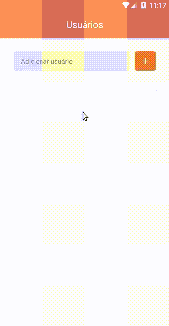

<h1 align="center">
 Teste Front-end Mobile
</h1>

  <a href="#tecnologias-utilizadas">Tecnologias</a> |
  <a href="#funcionalidade">Funcionalidade</a> |
  <a href="#como-rodar">Como Rodar</a> |
  <a href="#telas">Telas</a>

  

[Desafio](https://github.com/carteiraonline/front-end-test/blob/master/README.md) proposto no teste para front-end mobile da Fliper

### Tecnologias utilizadas

- [axios](https://github.com/axios/axios)
- [prop-types](https://github.com/facebook/prop-types)
- [react](https://github.com/facebook/react)
- [react-native](https://github.com/facebook/react-native)
- [react-native-community/async-storage](https://github.com/react-native-community/async-storage)
- [react-native-gesture-handler](https://github.com/kmagiera/react-native-gesture-handler)
- [react-native-vector-icons](https://github.com/oblador/react-native-vector-icons)
- [react-native-webview](https://github.com/react-native-community/react-native-webview)
- [react-navigation](https://github.com/react-navigation/react-navigation)
- [reactotron-react-native](https://github.com/infinitered/reactotron-react-native)
- [styled-components](https://github.com/styled-components/styled-components)

### Pré-requisitos

- Yarn/Npm
- Emulador android configurado

### Como rodar

Carregamos as depedências

> yarn

ou

> npm install

Iniciamos o metro bundler

> react-native start

Rodamos o aplicativo no emulador do android

> react-native run-android

### Telas

Usuários

- Lista os usuários adicionados a lista
- Possibilita a adicão de novos usuários
- Possibilita a remoção de usuários da lista

Repositórios

- Lista os repositórios públicos de um determinado usuário

Repositório

- Abre o reposótorio numa webview
